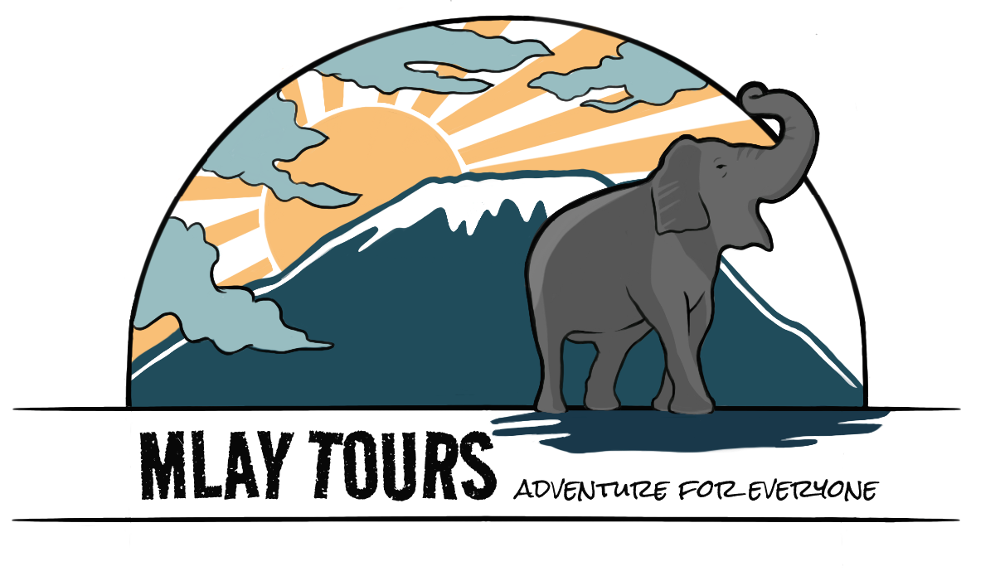
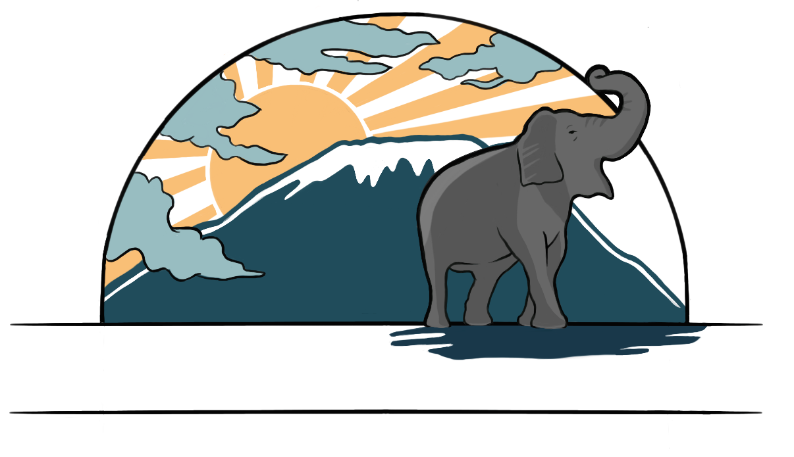
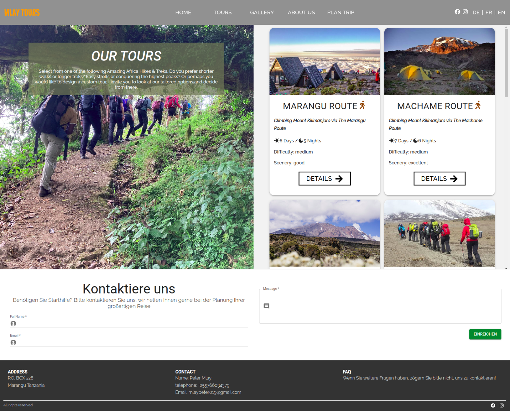
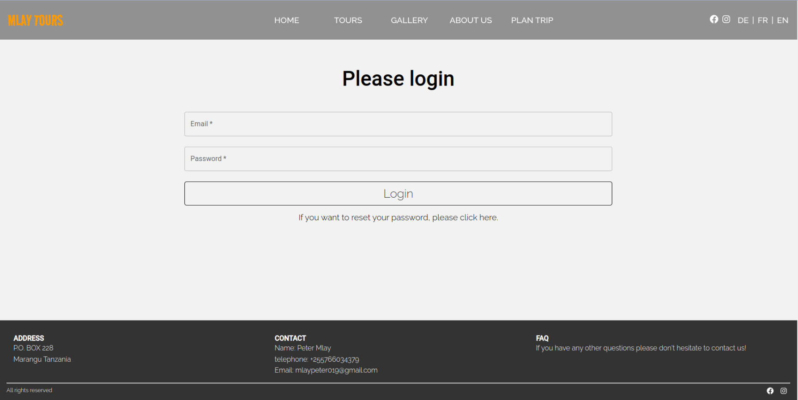

# MLAY EXCURSSIONS FULLSTACK PROJECT

## Table of Contents

* [Backend Project](#Backend-Project)
   * [Logo](#logo)
   * [Project Description](#Project-description)
   * [Key Features](#key-features)
   * [User Registration & Login](#user-registration-&-login)
   * [Technologies Used](#technologies-used)
   * [Figma](#Figma)
   * [Screenshots](#screenshots)

## Logo

## Project Description 
A website for Mlay Tours, a company based in Tanzania, offering a variety of trips  in the Region. It allows the client to show his offers with detailed information about the tours. Enables the CEO to manage his own content.

## Key features 
* Server Side Programming
* Admin permissions for managing own content
* Contact forms for inquiries 
* Supports changing the language to EN, FR, DE	

## User Registration & Login

We Provide the client with a URL where he has admin access to add, remove or update the Tours Page. We used bcrypt, to generate a hashed password and JWT to create a token for registration to access protected routes and sends a new token when he changes his password via a dashboard.

</img>

## Technologies used 

-   Planning & Control: Notion, Jira.
-   Conception & Design: Figma, Procreate.
-   Frontend: HTML5, CSS3, JavaScript, React, SASS, Material UI, React Icons, Icons, Yup,  	Formik
-   Backend: Node JS, Express JS, MongoDB, JWT, Bcrypt

</img>
</img>
</img>
</img>
</img>
</img>
</img>
</img>

# Figma

The wireframes for mobile and desktop version where created in Figma. Please find them here: [Figma Wireframes](https://www.figma.com/file/dXhUhiaht8ujhgEjbpTp1J/Wireframe-Tours?node-id=0:1&t=YHJfuEyuAfRSpLgC-1)

## Screenshots 
Heres a look at the final result.

## Have a look at the final result: [live version](https://mlaytours.onrender.com/)

 